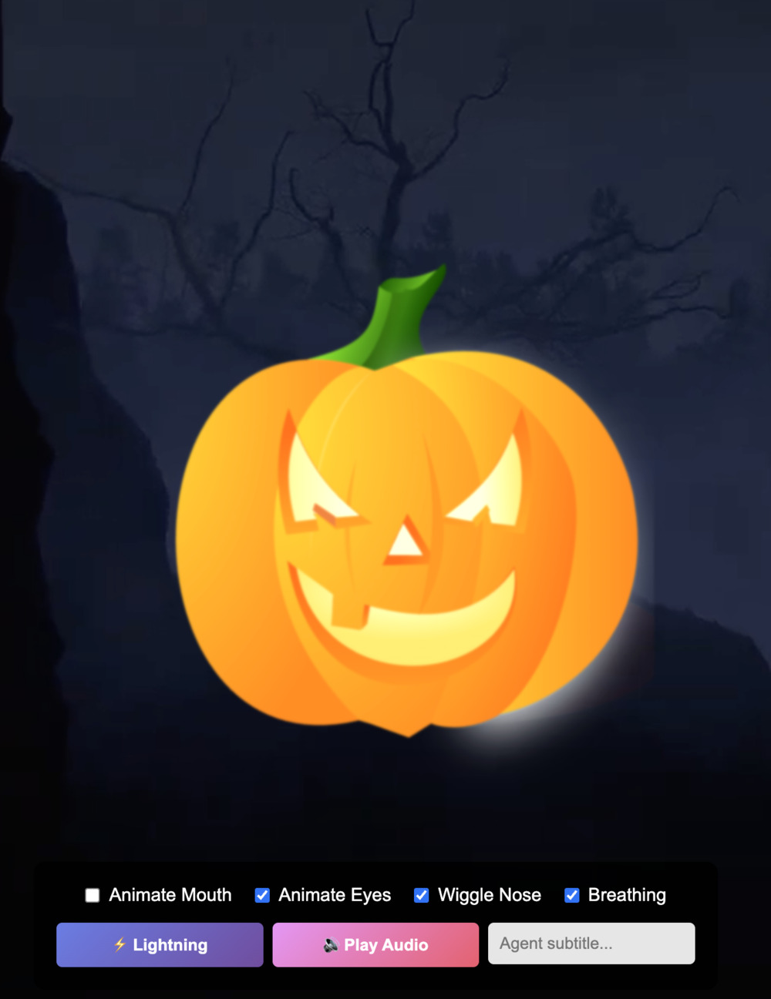

# Pompernikkel

This repo contains an animated HTML/SVG pumpkin named Pompernikkel for an interactive Halloween wall projection. The page features a breathing pumpkin with animated mouth/eyes/nose, ambient audio and background video, subtitles, a lightning effect, and on-screen controls. You can also drive the animation and interactivity via a simple WebSocket server.

In the actual setup Pompernikkel was connected to an LLM and could answer questions by kids - or adult using some additonal components.

	
	 
	<em>Pompernikkel — animated HTML/SVG pumpkin</em>

## Getting started

You can use Pompernikkel as a static page, or control it remotely over WebSocket using the included Ruby demo server.

- Static preview (no server required)
	- Download or clone this project.
	- Open `html/index.html` in a modern desktop browser (Chrome, Edge, or Firefox recommended).
	- Use the on-screen controls to toggle mouth/eyes/nose/breathing, trigger lightning, and toggle ambiance audio. Clicking the pumpkin also toggles audio.

- WebSocket demo (Ruby)
	- Ensure you have Ruby and the `em-websocket` gem available.
	- Start the demo server in `ruby/ws_example.rb` to serve a WebSocket on `ws://localhost:8080`.
	- Open `html/index.html` in your browser; the page will connect automatically and play a short demo sequence (subtitles, mouth talking, lightning, and recording indicators).

Notes
- The HTML references optional media files (e.g., `halloween.mp4`, `ambiance.mp3`, `thunder.mp3`). If those files are present in `html/`, effects like background video and sounds will play; otherwise the page still loads without them.
- The WebSocket protocol used by the page is simple JSON messages (e.g., actions for `mouth`, `subtitle`, and `event` like `lightning`). See `ruby/ws_example.rb` and inline comments in `html/index.html` for examples.

## Credits

By Joren Six with the help of Claude.

